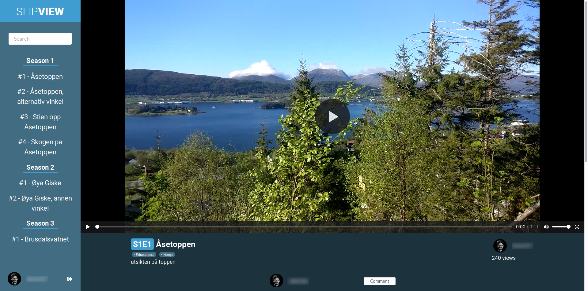
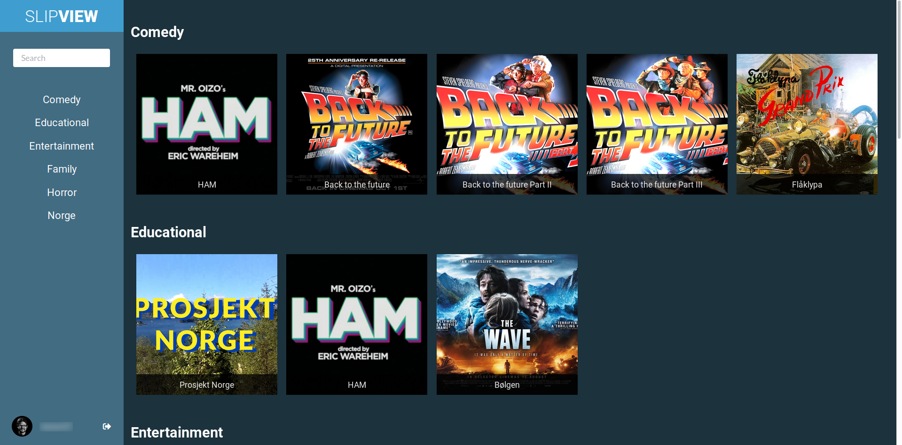
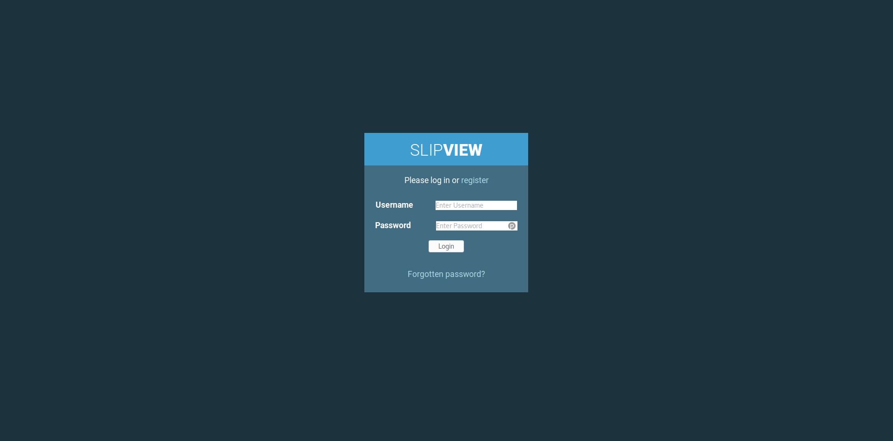
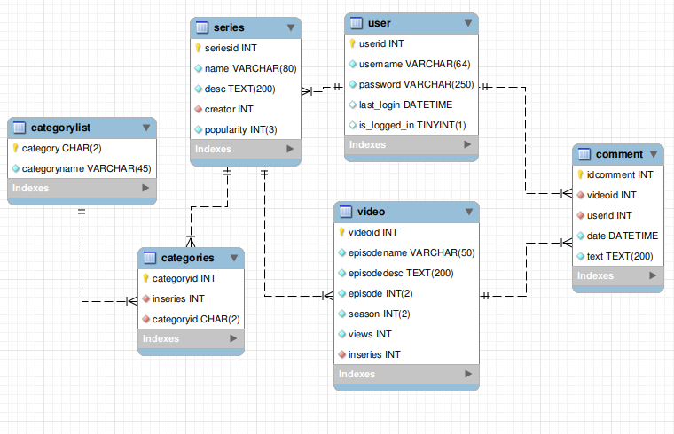

# Slipview
Slipview is a PHP only, no Javascript video streaming and sharing site. It has a registration and login system where users can comment on the different episodes that has been uploaded. The user can also later delete his comment(s) if he/she is not happy with it.

This website was made as a proof of consept and made to be a challenege for me to develop something without the access to javascript, at all. 0 lines of javascript, just pure PHP. >;)

# Features

* Login/Logout system
* Forgotten password
* Register
* Token system to check if user is logged in
* Commenting system (with the ability to remove comments)
* Easy to understand season/episode system
* Categorysystem
* Multiple categories per series
* Search
* Viewcounter

# Dependencies

* PHP 7.0 <
* MySQL database

## Building

Building is rather simple.

1. Set up a LAMP/LEMP or similar stack for PHP.
2. Set up mySQL database with database.sql (or set up with the picture of the database under screenshots).
3. clone repo under a subfolder of your choosing (for example slipview/)
4. Point stack to the location.
5. Enjoy!

# Screenshots

